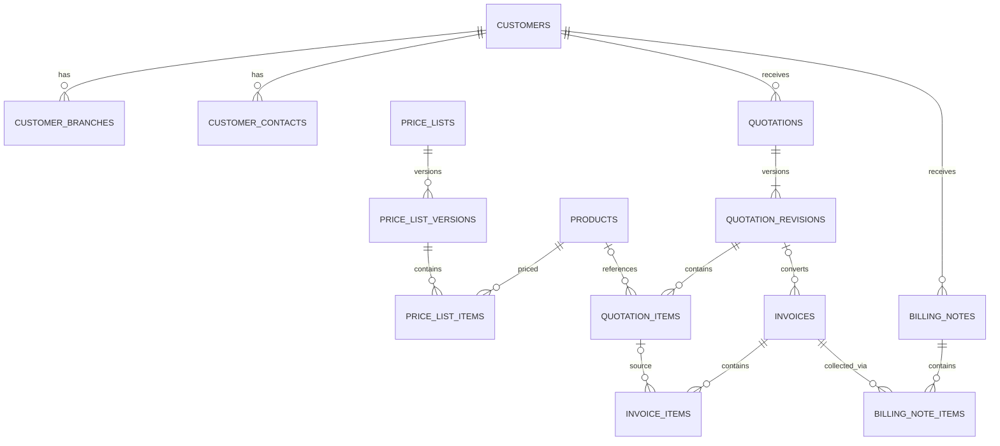

# แบบฐานข้อมูล PostgreSQL สำหรับระบบงานขาย

วันที่ออกแบบ: 20 กันยายน 2026

เอกสารนี้เป็นแบบเสนอสำหรับพัฒนา ไม่ใช่ migration ที่รันแล้ว สมมติฐานเริ่มต้นคือใช้ภายในบริษัทเดียว มีหลายสาขา ใช้ THB และเก็บประวัติเอกสารย้อนหลัง จุดที่ยังไม่ยืนยันแยกไว้ท้ายเอกสาร

## 1. สิ่งที่พบจากไฟล์จริง

| แหล่งข้อมูล | สิ่งที่ตรวจพบ | ผลต่อแบบฐานข้อมูล |
|---|---|---|
| `Customer.xlsx`, `Customer!A1:M55` | ลูกค้า 54 ราย รหัสลูกค้าไม่ซ้ำ มีเครดิต สาขา ที่อยู่ ผู้ติดต่อ และวันรับเงิน | ต้องมีโมดูลลูกค้า แยกสาขาและผู้ติดต่อ |
| `pricelist.xlsx`, `Sheet1!A1:O2` | สินค้าตัวอย่าง 1 รายการ มี Model, VendorPart และราคา 5 ช่อง | แยกสินค้าออกจากประวัติราคา และเก็บฐานภาษีของราคาให้ชัด |
| `Quotation.xlsx`, `Quotation!A1:S224` | 223 แถวข้อมูล แต่เลขใบเสนอราคาไม่ซ้ำ 222 เลข | ห้ามนำเข้าด้วยการ upsert เลขเอกสารโดยไม่ตรวจซ้ำ |
| `Quotation.xlsx`, `'Quotation by items'!A1:Q366` | รายการ 365 แถว อ้างถึงเลขใบเสนอราคา 222 เลขชุดเดียวกับชีตสรุป | ใช้โครงสร้างหัวเอกสาร 1 ต่อหลายรายการ |
| ชีต Quotation คอลัมน์ D | มีเลขใบแจ้งหนี้/ส่งของเดิม | เก็บ external reference ก่อน เพราะไม่มีรายละเอียด Invoice ต้นฉบับ |

สถานะในชีตสรุปนับตามแถว: แบบร่าง 93, อนุมัติ 29, ยืนยันสั่งซื้อ 101 ต้องยืนยันว่า “อนุมัติ” หมายถึงการอนุมัติภายในหรือการตอบรับจากลูกค้า ไม่ map ความหมายโดยเดา

ประเด็นคุณภาพข้อมูล:

- `Quotation!A185:A186` มีเลข `QT-210610002` ซ้ำ แต่ยอดต่างกัน ต้องตรวจต้นฉบับก่อนรวม แยก หรือจัดเป็น revision
- การเทียบผลรวมรายการกับยอดหัวเอกสารแบบตรง ๆ พบต่างกัน 9 แถวหัวเอกสาร ครอบคลุม 8 เลขเอกสาร เป็นรายการรอตรวจ ไม่ได้แปลว่าผิดทั้งหมด เพราะมีส่วนลดท้ายบิล ราคาฐานรวมภาษี และวิธีปัดเศษต่างกัน
- ตัวอย่าง `QT-240620001` มีส่วนลดท้ายบิล 450 จึงไม่ควรเทียบยอดรายการโดยละเลยส่วนลด
- `pricelist!O2` เป็น `19/20/2023` ซึ่งแปลงเป็นวันที่มาตรฐานไม่ได้, `M2` เป็น `Active/Inatcive` ที่ยังไม่ใช่สถานะชัดเจน และ `N2` เป็นวันหมดอายุในอดีต
- SRP รวมภาษี 56,700 กับ SRP ไม่รวมภาษี 52,990 ไม่สัมพันธ์กันพอดีหากทดลองอัตรา 7% จึงต้องเก็บค่าต้นฉบับและยืนยันว่าค่าใดเป็นราคาหลัก
- `Customer` มีวันรับเงินเป็นเลขวันของเดือนถึง 31 แต่วันรับวางบิลว่างทั้งหมด ต้องกำหนดกรณีเดือนสั้นและวันหยุดภายหลัง
- ชื่อลูกค้าในหัวใบเสนอราคาตรงกับชื่อใน Customer เมื่อเทียบข้อความตามที่อ่านได้ แต่การเชื่อมจริงควรใช้รหัสลูกค้าและให้ตรวจกรณีชื่อซ้ำ
- ชีตรายการสินค้าไม่มีรหัสสินค้า ส่วนรหัสในชีตสรุปไม่ครอบคลุมทุกรายการ ห้ามใช้รหัสจากหัวเอกสารแจกให้ทุกบรรทัด หรือใช้ชื่อสินค้าเป็น unique key
- ไฟล์ Quotation ที่พบเป็นตารางส่งออก 2 ชีต ยังไม่มีหลักฐานเพียงพอสำหรับยืนยันรูปแบบหน้าพิมพ์ใบเสนอราคาจริง

## 2. ขอบเขตและความสัมพันธ์

เสนอแยกตารางตามชนิดเอกสาร เพื่อให้สถานะและกติกาของใบเสนอราคา ใบแจ้งหนี้ และใบวางบิลชัดเจน ใช้บริการคำนวณและออก PDF ร่วมกัน

ในแบบชั่วคราวนี้ `Invoice` หมายถึงใบแจ้งหนี้ ส่วนใบกำกับภาษีเป็นชนิดเอกสารที่ต้องยืนยันเพิ่มเติม ไม่สร้างใบแจ้งหนี้สองชุดที่ลงยอดหนี้ซ้ำ

รายการสินค้าอ้าง Product ได้แบบ nullable เพื่อรองรับประวัติและบริการเฉพาะงาน แต่ต้องมีชื่อ รายละเอียด หน่วย และราคาที่บันทึกไว้ในเอกสารเสมอ เอกสาร draft อาจยังไม่มีรายการ ก่อนออกเอกสารต้องมีอย่างน้อยหนึ่งรายการ

## 3. มาตรฐานคอลัมน์

- PK ใช้ `uuid`; FK ใช้ชนิดเดียวกัน ทุกตารางหลักมี `created_at`, `updated_at` เป็น `timestamptz` และผู้ทำรายการ `created_by`, `updated_by` ตามความเหมาะสม
- วันเอกสาร วันหมดอายุ และวันครบกำหนดใช้ `date`; เวลาเหตุการณ์แสดงตาม Asia/Bangkok
- รหัสสินค้า เลขผู้เสียภาษี รหัสสาขา เบอร์โทร และเลขเอกสารใช้ `text` เพื่อรักษาเลขศูนย์นำหน้า
- จำนวนและราคาต่อหน่วยใช้ `numeric(20,6)`; ยอดเงินเอกสาร THB ใช้ `numeric(20,2)`; อัตราภาษี/ส่วนลดใช้ `numeric(7,4)` โดย 7 หมายถึง 7%
- ใช้ `numeric` สำหรับเงินตาม [PostgreSQL Numeric Types](https://www.postgresql.org/docs/current/datatype-numeric.html) และใช้ decimal arithmetic ฝั่งแอป ห้ามให้ JavaScript floating point เป็นแหล่งคำนวณยอดสุดท้าย
- ใช้ FK, unique, not null และ check ตาม [PostgreSQL Constraints](https://www.postgresql.org/docs/current/ddl-constraints.html); กติกาข้ามหลายแถวตรวจใน transaction ไม่อ้างว่า CHECK ธรรมดาป้องกันได้ทั้งหมด
- ใช้ text + CHECK สำหรับสถานะในระยะแรก; master data ใช้ `is_active` แทนลบเมื่อมีประวัติอ้างถึง และ FK เอกสารใช้ `ON DELETE RESTRICT`
- `jsonb` ใช้เฉพาะข้อมูลดิบจากไฟล์ payload ของ audit และ snapshot แบบมี schema version; ความสัมพันธ์และยอดเงินหลักเป็นคอลัมน์ที่ query ได้

## 4. ตารางและคอลัมน์สำคัญ

ชื่อคอลัมน์ที่ลงท้าย `_id` เป็น FK เว้นแต่ระบุว่าเป็นรหัสภายนอก ทุกตารางมี PK `id` เว้นแต่ระบุ composite PK

### 4.1 บริษัท ผู้ใช้ และสิทธิ์

| ตาราง | คอลัมน์สำคัญ | กติกา |
|---|---|---|
| `companies` | legal_name, tax_id, address, phone, email, logo_file_id | บริษัทผู้ออกเอกสาร เริ่มต้น 1 บริษัท |
| `company_branches` | company_id, branch_code, name, address | unique(company_id, branch_code) |
| `users` | auth_subject, email, display_name, is_active | auth_subject unique, unique(lower(email)); ไม่เก็บรหัสผ่านแบบ plaintext |
| `roles` | code, name | code unique เช่น admin, sales, manager, accounting |
| `permissions` | code | code unique เช่น quotation.approve, price.cost.read |
| `user_roles` | user_id, role_id | composite PK(user_id, role_id) |
| `role_permissions` | role_id, permission_id | composite PK(role_id, permission_id) |

การพิสูจน์ตัวตนใช้ผู้ให้บริการหรือไลบรารีที่เลือกตอน implementation โดยตาราง users เป็น business profile; ถ้าเก็บ session ในฐานข้อมูลให้ใช้ schema ของระบบ auth นั้น ไม่ออกแบบ crypto เอง

### 4.2 ลูกค้า

| ตาราง | คอลัมน์สำคัญ | กติกา |
|---|---|---|
| `customers` | customer_code, legal_name, tax_id nullable, credit_days nullable, billing_schedule_text, payment_schedule_text, notes, owner_user_id nullable, is_active | customer_code unique; credit_days >= 0; ค่าไม่ทราบเป็น null |
| `customer_branches` | customer_id, branch_code nullable, branch_name, billing_address, shipping_address | unique(customer_id, branch_code) เมื่อมีรหัส; ไม่ตีความชื่อสำนักงานใหญ่เป็นรหัสภาษีโดยไม่ยืนยัน |
| `customer_contacts` | customer_id, customer_branch_id nullable, name, phone, email, is_primary | contact และ branch ต้องอยู่ภายใต้ลูกค้าเดียวกัน |

ระยะแรกเก็บเงื่อนไขวางบิล/รับเงินเป็นข้อความจาก Excel ไม่แปลงเป็นกำหนดรับเงินจริงโดยอัตโนมัติ หากต้องสร้างปฏิทิน ให้เพิ่ม `customer_schedule_rules` (customer_id, kind, day_of_month, short_month_policy, holiday_policy) หลังตกลงกติกา

### 4.3 สินค้าและราคา

| ตาราง | คอลัมน์สำคัญ | กติกา |
|---|---|---|
| `product_categories` | code, name, parent_id nullable | code unique; ป้องกันวงจร parent |
| `units` | code, name | code unique เช่น ชิ้น, งาน, license |
| `products` | product_code, model, vendor_part, name, description, kind, type_label, category_id, unit_id, warranty_text, is_active | product_code unique; kind = hardware/service/subscription; Model และ VendorPart ไม่บังคับ unique ก่อนตรวจข้อมูล |
| `price_lists` | code, name, currency_code, is_active | code unique; currency_code เริ่ม THB |
| `price_list_versions` | price_list_id, version_no, valid_from, valid_to nullable, status, published_by, published_at | unique(price_list_id, version_no); status draft/published/retired; valid_to >= valid_from |
| `price_list_items` | price_list_version_id, product_id, srp_inc_vat, srp_exc_vat, ndp_exc_vat, online_price, online_tax_basis, selling_price, selling_tax_basis, vat_rate nullable, valid_to nullable, remark | unique(version_id, product_id); ราคา nullable เมื่อไม่ทราบ ไม่แทนด้วยศูนย์; ราคาที่มีต้อง >= 0 |

`online_tax_basis` และ `selling_tax_basis`: inclusive/exclusive/unknown; ค่า unknown เก็บนำเข้าได้แต่ห้ามนำไปคำนวณข้อเสนอโดยอัตโนมัติ `NDPExcVat` เป็นชื่อราคาจากต้นฉบับ ต้องยืนยันก่อนใช้เป็นต้นทุนคำนวณกำไร

การเผยแพร่ version ล็อก price_list เดียวกันใน transaction แล้วตรวจช่วงเวลาของ published version ไม่ให้ซ้อนกัน สำหรับระยะแรกทั้งชุดใช้ช่วงเวลาเดียว รายการหมดอายุเร็วกว่าชุดได้ เลือกราคาจากรายการที่ยังใช้ได้เท่านั้น Published version แก้ราคาไม่ได้ ต้องสร้าง version ใหม่

ราคาที่ Sales เลือก: ชุดราคาที่ระบุ + วันที่เอกสาร → SellingPrice ที่ทราบฐานภาษี → อนุญาตกรอกเองตามสิทธิ์พร้อมเหตุผล ไม่ fallback ไปต้นทุนหรือราคาอื่นอย่างเงียบ ๆ หากไม่มีราคาที่ใช้ได้

### 4.4 ใบเสนอราคา

| ตาราง | คอลัมน์สำคัญ | กติกา |
|---|---|---|
| `quotations` | company_branch_id, quotation_no, customer_id, owner_user_id, current_revision_id | unique(company_branch_id, quotation_no); current_revision ต้องเป็นลูกของ quotation เดียวกัน |
| `quotation_revisions` | quotation_id, revision_no, document_date, valid_until, customer_branch_id, contact_id, project_name, sales_channel, credit_days, currency_code, tax_mode, seller_snapshot, customer_snapshot, contact_snapshot, payment_terms, delivery_terms, notes, subtotal, line_discount_total, document_discount_amount, taxable_amount, vat_amount, grand_total, estimated_wht_amount, estimated_receivable, status, legacy_status, row_version | unique(quotation_id, revision_no); แยกยอดก่อน/หลังส่วนลด; row_version ใช้ตรวจแก้ไขชนกัน |
| `quotation_items` | quotation_revision_id, line_no, product_id nullable, source_price_list_item_id nullable, product_code_snapshot, name, description, unit_name, quantity, unit_price_ex_vat, input_tax_basis, input_unit_price, line_discount_amount, document_discount_allocated, tax_code, vat_rate, net_amount, vat_amount, total_amount, wht_rate, wht_base_amount, warranty_text, service_start, service_end | unique(revision_id, line_no); quantity > 0; แยก exempt/zero/standard แม้อัตรา 0 เท่ากัน |
| `quotation_approvals` | quotation_revision_id, requested_by, requested_at, decided_by, decided_at, decision, reason, content_hash | ผูกการอนุมัติกับ revision และเนื้อหาที่อนุมัติ |

snapshot ประกอบด้วยชื่อ ที่อยู่ เลขภาษี สาขา และข้อมูลติดต่อที่ต้องปรากฏใน PDF รวมถึงบริษัทผู้ขาย ไม่อ่านค่าปัจจุบันจาก master มาแทนเอกสารเก่า ทุก snapshot มี schema_version

ทั้ง `quotation_revisions` และ `invoices` เพิ่ม `calculation_policy_version`, `salesperson_name_snapshot`, `source_import_row_id` nullable และ `is_legacy` เพื่อแยกวิธีคำนวณและประวัติจากระบบเดิม รายการจาก Excel ที่ยังจับคู่ผู้ใช้ไม่ได้ให้ owner_user_id เป็น null สำหรับ legacy และเก็บชื่อเดิมไว้; เอกสารใหม่ต้องมีผู้รับผิดชอบที่มีสิทธิ์

สถานะ revision ที่เสนอ: draft → pending_approval → approved → sent → accepted หรือ rejected/expired; cancelled สำหรับยกเลิก และ superseded สำหรับฉบับที่ถูกแทนที่

เมื่อถูกปฏิเสธภายในให้กลับ draft พร้อมบันทึกเหตุผล; approved/sent ที่เปลี่ยนสาระสำคัญต้องออก revision ใหม่และอนุมัติใหม่ ห้ามแก้ย้อนหลังให้ approval เดิมยังมีผล accepted revision ที่ออก Invoice แล้วแก้หรือลบทิ้งไม่ได้

### 4.5 ใบแจ้งหนี้ / Invoice (ชื่อชั่วคราวรอยืนยัน)

| ตาราง | คอลัมน์สำคัญ | กติกา |
|---|---|---|
| `invoices` | company_branch_id, invoice_no, customer_id, source_quotation_revision_id nullable, document_date, due_date, currency_code, seller_snapshot, customer_snapshot, payment_terms, tax_mode, subtotal, line_discount_total, document_discount_amount, taxable_amount, vat_amount, grand_total, estimated_wht_amount, status, issued_at, cancelled_at, cancellation_reason, row_version | unique(branch_id, invoice_no); due_date >= document_date |
| `invoice_items` | invoice_id, line_no, source_quotation_item_id nullable, product_id nullable, code/name/description/unit snapshots, quantity, unit_price_ex_vat, input_tax_basis, input_unit_price, line_discount_amount, document_discount_allocated, tax_code, vat_rate, net_amount, vat_amount, total_amount, wht_rate, wht_base_amount | unique(invoice_id, line_no); มี snapshot ของตัวเอง ไม่ดึงราคาจากใบเสนอราคาทุกครั้งที่พิมพ์ |

สถานะเอกสาร: draft → issued → cancelled ตามสิทธิ์; สถานะชำระเงิน unpaid/partial/paid และ overdue เป็นค่าที่คำนวณแยกจากสถานะเอกสาร เมื่อเริ่มบันทึกรับชำระจริง

ใบเสนอราคาหนึ่ง revision ออก Invoice หลายใบได้เพื่อรองรับแบ่งส่งในอนาคต ก่อน issue ล็อกรายการใบเสนอราคาที่เกี่ยวข้อง แล้วตรวจผลรวมจำนวนใน Invoice ที่มีผลไม่เกินจำนวน accepted; ยกเลิกต้องมี audit และคืนจำนวนที่ใช้อ้างอิงใน transaction เดียวกัน ระยะแรก UI อาจจำกัดออกเต็มใบครั้งเดียว

ถ้าต้องการวางบิลแบบมัดจำ/แบ่งงวดตามยอดเงิน ต้องเพิ่ม installment schedule ไม่ใช้การยัดจำนวนสินค้าเพื่อเลียนแบบงวดเงิน

ถ้า Invoice หมายถึงใบกำกับภาษี: เพิ่ม `tax_invoices` และ `tax_invoice_items` ที่อ้างถึง Invoice และ snapshot ของตนเอง มีเลขเอกสารแยก ไม่ลงยอดหนี้ซ้ำ ต้องยืนยันขั้นตอนออกเอกสารก่อนทำ migration ส่วนนี้

### 4.6 ใบวางบิล

| ตาราง | คอลัมน์สำคัญ | กติกา |
|---|---|---|
| `billing_notes` | company_branch_id, billing_note_no, customer_id, customer_branch_id, currency_code, document_date, appointment_date, seller_snapshot, customer_snapshot, total_amount, status, issued_at, cancelled_at, notes | unique(branch_id, billing_note_no); draft/issued/cancelled |
| `billing_note_items` | billing_note_id, invoice_id, line_no, invoice_no_snapshot, invoice_date_snapshot, due_date_snapshot, outstanding_at_issue, billed_amount, released_at nullable, release_reason nullable | unique(billing_note_id, invoice_id); billed_amount > 0 |

หนึ่งใบวางบิลรวมหลาย Invoice ของลูกค้า สาขาลูกค้า บริษัทผู้ออก และสกุลเงินเดียวกันเท่านั้น ล็อก Invoice ที่เลือกและคำนวณยอดค้างใหม่ตอนออกใบวางบิล ไม่ใช้ยอดที่ browser ส่งมา

ค่าเริ่มต้นที่เสนอ: Invoice หนึ่งใบอยู่ได้ในใบวางบิลที่ยังมีผลหนึ่งใบ ใช้ partial unique index ที่ invoice_id WHERE released_at IS NULL (รวมการจองใน draft); ยกเลิก draft/ใบวางบิลหรือปิดรอบต้อง release ทุกรายการใน transaction แล้วจึงวางบิลใหม่ได้ เก็บ outstanding_at_issue เป็นประวัติ ไม่อัปเดตตามยอดค้างปัจจุบัน

การปิดรอบในที่นี้คือ action ที่ผู้มีสิทธิ์ยืนยันให้รายการพร้อมสำหรับวางบิลครั้งใหม่ มีเหตุผลและ event รองรับ ไม่เท่ากับการยืนยันว่าลูกค้าชำระแล้ว หากยังไม่เชื่อมยอดรับชำระ ต้องให้ Accounting ยืนยันยอดที่จะวางบิลพร้อมแหล่งอ้างอิง และระบุว่าเป็นยอดยืนยันโดยผู้ใช้ ไม่ใช่ยอดค้างที่ระบบคำนวณจากรับชำระ

### 4.7 ตารางสนับสนุน

| ตาราง | คอลัมน์สำคัญ / หน้าที่ |
|---|---|
| `document_sequences` | company_branch_id, document_type, period_key, last_number; unique(branch, type, period); ออกเลขใน transaction ห้าม MAX()+1 |
| `document_events` | FK ไป quotation_revision/invoice/billing_note อย่างใดอย่างหนึ่ง, event_type, actor_id, occurred_at, reason; CHECK ให้มี target เดียว |
| `files` | storage_key unique, original_name, mime_type, byte_size, sha256, created_by; ไฟล์จริงอยู่ private storage |
| `document_files` | file_id, FK target อย่างใดอย่างหนึ่ง, purpose, template_version, content_hash; CHECK target เดียว; PDF ที่ออกแล้วเก็บไฟล์ฉบับนั้น |
| `audit_logs` | actor_id nullable, entity_type, entity_id, action, before_json, after_json, request_id, occurred_at; generic reference ใช้เฉพาะ audit; append-only |
| `import_batches` | filename, file_sha256, mapping_version, status, imported_by, started_at, finished_at; unique(file_sha256, mapping_version) |
| `import_rows` | batch_id, sheet_name, row_number, raw_data jsonb, normalized_data jsonb, validation_errors jsonb, status; unique(batch_id, sheet_name, row_number) |
| `import_entity_links` | import_row_id, target_type, target_id, resolution_note, resolved_by; เก็บที่มาของ record โดยเฉพาะการรวมหลายแถว |
| `external_document_references` | quotation_revision_id, reference_type, reference_no, source_import_row_id; เก็บเลข IN เดิมโดยไม่สร้างยอดหนี้สมมติ |
| `idempotency_requests` | actor_id, operation, key, request_hash, result_id, completed_at; unique(actor_id, operation, key); ป้องกันกดออกเอกสารซ้ำ |

ส่วนขยายที่แนะนำหลังขอบเขตหลัก: `payments` (customer_id, company_branch_id, currency, received_date, amount, method, reference, status), `payment_allocations` (payment_id, invoice_id, cash_amount, withholding_amount), `withholding_certificates` (customer_id, certificate_no, received_date, file_id) และ linkage กับ allocation เพื่อคำนวณยอดค้างจริงและรองรับรับเงินบางส่วน ต้องตรวจยอดจัดสรรไม่เกินเงินรับและยอดหนี้ภายใต้ lock; ถ้ายังไม่ทำส่วนนี้ ห้ามแสดง unpaid เป็นข้อเท็จจริงหรือรายงานยอดค้างว่าเป็นยอดที่กระทบรับเงินจริงแล้ว

## 5. กติกาคำนวณและรักษาประวัติ

1. บันทึกฐานราคา inclusive/exclusive ชัดเจน และ normalize เป็นฐานไม่รวมภาษีสำหรับคำนวณ เก็บราคาที่ผู้ใช้กรอกไว้ด้วย
2. รายการ: จำนวน × ราคาต่อหน่วย − ส่วนลดรายการ = ยอดก่อนส่วนลดท้ายเอกสาร ส่วนลดทุกชนิดต้องไม่ทำให้ฐานติดลบ
3. กระจายส่วนลดท้ายเอกสารตามสัดส่วนไปยังรายการที่เข้าเกณฑ์ก่อนคำนวณภาษี ปัดเงิน 2 ตำแหน่งและจัดเศษตกค้างอย่างคงที่ตาม line_no ให้ยอดส่วนลดที่กระจายรวมเท่ายอดท้ายบิล
4. คำนวณภาษีตาม tax_code และอัตราของแต่ละรายการ; แยกภาษี 0% กับยกเว้น เก็บ rate snapshot และ calculation_policy_version ไม่ hardcode อัตราจากตัวอย่างเป็นกฎหมายปัจจุบัน
5. รวม net_amount + vat_amount เป็น grand_total; ยอดคาดว่าจะรับหลังหัก ณ ที่จ่ายแสดงแยก ไม่ใช้ WHT เป็นส่วนลดรายได้หรือส่วนลด VAT
6. WHT ใช้ฐานและอัตราต่อรายการที่ระบุอย่างชัดเจน ยอดในใบเสนอราคาเป็นประมาณการ; การปิดหนี้จริงใช้เงินรับและหลักฐานหัก ณ ที่จ่ายที่จัดสรรแล้ว
7. Server คำนวณใหม่ก่อนบันทึกและ issue; จำนวนเงินใน API ส่งเป็น decimal string; UI แสดง preview จากกติกาเดียวกัน
8. เอกสารที่ออกแล้ว immutable สำหรับข้อมูลทางการค้า เปลี่ยนแปลงผ่าน revision/ยกเลิก/เอกสารปรับปรุงที่ตกลง ห้ามลบเอกสารที่มีเลขแล้ว
9. รูปแบบเลขเสนอ `QT-YYMMDDNNN`, `IN-YYMMDDNNN`, `BN-YYMMDDNNN` อ้างอิงรูปแบบที่พบ แต่ต้องยืนยัน ค.ศ./พ.ศ. และขอบเขตสาขา; เก็บเลข legacy ตามจริงพร้อม trace

การล็อกแถวและ transaction ใช้ป้องกันออกเลข ชำระเงิน และแปลงรายการซ้ำตาม [PostgreSQL Explicit Locking](https://www.postgresql.org/docs/current/explicit-locking.html) ล็อกหลายแถวตามลำดับ id เดียวกันเสมอและรองรับ retry เมื่อ deadlock

## 6. ดัชนีและขอบเขตการบังคับกติกา

- B-tree ที่ FK ที่ใช้ join และค้นหาบ่อย โดย PostgreSQL ไม่สร้างดัชนีฝั่งลูกของ FK ให้อัตโนมัติ
- `quotations(customer_id, created_at desc)`, `quotations(owner_user_id, created_at desc)`
- `quotation_revisions(status, document_date desc)`, `invoices(customer_id, due_date)` และ `invoices(status, document_date desc)`
- `price_list_items(product_id, price_list_version_id)` และ `import_rows(batch_id, status)`
- ค้น product_code/model/vendor_part ด้วย exact/prefix ก่อน เพิ่ม trigram search เมื่อวัดแล้วจำเป็น
- DB ตรวจ PK/FK/unique/check และข้อห้ามลบ; application service ตรวจสิทธิ์ การเปลี่ยนสถานะ และราคาใน transaction
- ความสอดคล้อง branch/contact กับ customer ใช้ composite FK โดยเพิ่ม unique(id, customer_id) ที่ตารางลูก; ทำแบบเดียวกันกับ invoice source item/revision และ current_revision/quotation เพื่อป้องกันอ้างผิดเจ้าของ
- ก่อนออกเอกสารตรวจยอดรายการรวมตรงหัวเอกสาร มีรายการอย่างน้อยหนึ่งรายการ และข้อมูลบังคับครบ ไม่หวังพึ่งหน้า UI
- หากต้องรองรับหลายบริษัทแยกข้อมูลจริงในอนาคต เพิ่ม company scope ทุก aggregate พร้อม composite FK/สิทธิ์ตามบริษัทก่อนเปิดใช้งาน ไม่ถือว่าแบบบริษัทเดียวเป็นระบบ multi-tenant แล้ว

## 7. ข้อที่ต้องตกลงก่อน implementation

1. Invoice เป็นใบแจ้งหนี้เดียวกัน หรือหมายถึงใบกำกับภาษี/Proforma/เอกสารอื่น?
2. บริษัทและสาขาที่ออกเอกสารมีกี่แห่ง ต้องใช้เลขเอกสารต่อสาขาหรือรวมทั้งบริษัท?
3. SellingPrice และ Online รวม VAT หรือไม่, NDP หมายถึงต้นทุนที่ใช้ได้จริงหรือไม่?
4. ใครเห็นต้นทุน ใครแก้ราคา ใครอนุมัติส่วนลด และ “อนุมัติ” ใน Excel หมายถึงอะไร?
5. ต้องออก Invoice บางรายการ/แบ่งงวด/มัดจำตั้งแต่รุ่นแรกหรือไม่?
6. จะบันทึกรับชำระ ใบเสร็จ ใบลดหนี้ และหลักฐาน WHT ในระบบนี้หรือเชื่อมระบบบัญชี?
7. ตัวอย่าง PDF/รูปแบบพิมพ์ที่ต้องใช้ และการจัดการเลข QT ซ้ำในข้อมูลเก่า

อัตราและเงื่อนไขภาษีในเอกสารนี้เป็นการออกแบบข้อมูล ไม่ใช่ข้อสรุปด้านภาษี ต้องให้ผู้รับผิดชอบบัญชียืนยันกติกาที่ระบบจะใช้ก่อนเปิดออกเอกสารจริง
